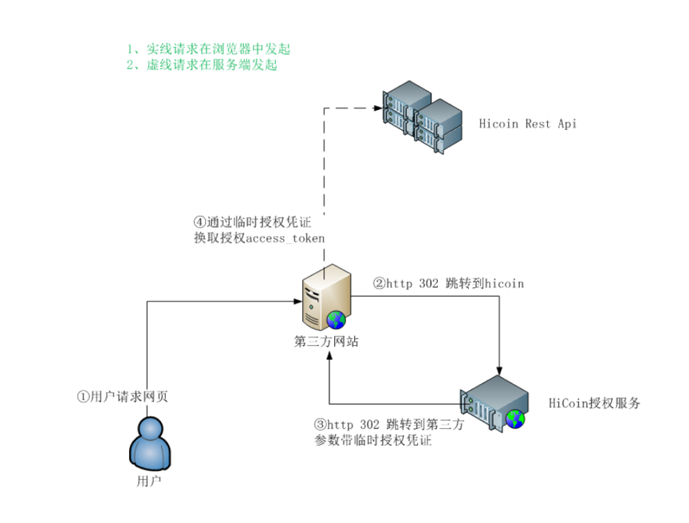

2 OAuth授权
====================

:域名: https://oauth.hicoin.vip/api

2.1 业务流程图
-------------------

2.2 H5授权跳转页面
--------------------------

:说明: 第三方静默授权页面跳转页面，注意：此接口无需公共参数
:页面访问地址: http://oauth.hicoin.one/api/connect/oauth/authorize  (测试环境)
              https://oauth.hicoin.vip/api/connect/oauth/authorize (生产环境环境)
:请求方式: GET
:请求参数:

===================== ========== ========== =================================================
参数名                 数据类型    是否必须    说明
app_id                string     是         第三方标识
redirect_uri          string     是         授权后重定向的回调链接地址， 请使用 urlEncode 对链接进行处理
response_type         string     是         返回类型，请填写code
scope                 string     是         应用授权作用域，说见下方重点字段说明
state                 string     否         重定向后会带上state参数，开发者可以填写a-zA-Z0-9的参数值，最多128字节
wallet_redirect       string     是         无论直接打开还是做页面302重定向时候，必须带此参数
===================== ========== ========== =================================================

**重点字段说明：**

- scope: snsapi_base（不弹出授权页面，直接跳转，只能获取用户openid），snsapi_userinfo（弹出授权页面，可通过openid拿到昵称、性别、所在地。并且， 即使在未关注的情况下，只要用户授权，也能获取其信息 ）
- state: 重定向后会带上state参数，开发者可以填写a-zA-Z0-9的参数值，最多128字节

:响应参数:
===================== ========== ========== =================================================
参数名                 数据类型    是否必须    说明
重定向                   string     是        如果用户同意授权，页面将跳转至 redirect_uri/?code=CODE&state=STATE。静默授权无需用户同意
===================== ========== ========== =================================================

2.3 授权code换取token与openid
---------------------------------------
:说明: 授权code换取token，注意：此接口无需公共参数
:接口地址: /sns/oauth/access_token
:请求方式: POST
:请求参数:

===================== ========== ========== =================================================
参数名                 数据类型    是否必须    说明
app_id                string     是         第三方标识
secret                string     是         第三方key
code                  string     是         填写上面获取的code参数
grant_type            string     是         填写为authorization_code
===================== ========== ========== =================================================

:响应参数:

===================== ========== ========== =================================================
参数名                 数据类型    是否必须    说明
access_token          string     是         网页授权接口调用凭证, 注意：此access_token与基础支持的access_token不同
expires_in            string     是         access_token接口调用凭证超时时间，单位（秒）
refresh_token         string     是         用户刷新access_token
openid                string     是         用户唯一标识
scope                 string     是         用户授权的作用域，使用逗号（,）分隔
===================== ========== ========== =================================================

2.4 刷新access_token
----------------------------------------
:说明: 刷新access_token（如果需要），注意：此接口无需公共参数
:接口地址: /sns/oauth/refresh_token
:请求方式: POST
:请求参数:

===================== ========== ========== =================================================
参数名                 数据类型    是否必须    说明
app_id                string     是         第三方标识
grant_type            string     是         填写为refresh_token
refresh_token         string     是         填写通过access_token获取到的refresh_token参数
===================== ========== ========== =================================================

:响应参数:

===================== ========== ========== =================================================
参数名                 数据类型    是否必须    说明
access_token          string     是         网页授权接口调用凭证, 注意：此access_token与基础支持的access_token不同
expires_in            string     是         access_token接口调用凭证超时时间，单位（秒）
refresh_token         string     是         用户刷新access_token
openid                string     是         用户唯一标识
scope                 string     是         用户授权的作用域，使用逗号（,）分隔
===================== ========== ========== =================================================
