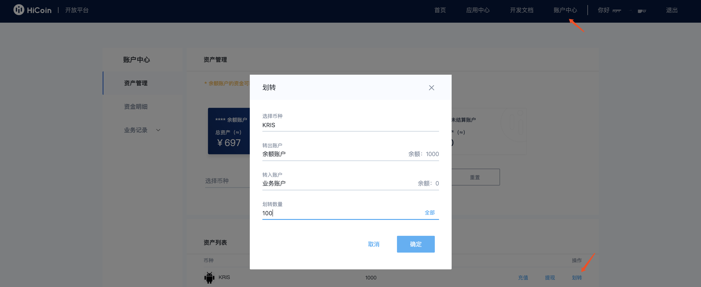

常见问题
====================

**1. 在App中打开应用时，提示“请在APP中访问此页面”**

出现此提示，通常有两方面原因造成： 1）不是在App中打开应用；2）调用的授权域名错误。如果您在测试环境，授权域名为http://oauth.hicoin.one，如果在生产环境授权域名为https://oauth.hicoin.vip

**2. 请求接口接口时，提示“无效的redirect_uri”**

确认您在开放平台填写的[授权域名]与正在访问的域名是在同一域。例如您正在访问的应用的地址为： https://www.abc.com:8080/caution?a=b&c=12 ，那么授权域名填写 https://www.abc.com 即可。

**3. 调用商户打款接口时，提示“code=110043, 您的账户可用余额不足”**

开发者账户划分为三种账户类型：余额账户，业务账户和未结算账户。用户在第三方平台进行充值，系统会调用H5支付接口，此时用户在钱包的资金会划转到开发者未结算账户。24小时之后未结算资金会自动划转到开发者业务账户。
商户打款接口是从开发者业务账户出资金，如果用户刚充值的资金未过24小时，用户充值的资金依旧在未结算账户，因此在调用商户打款接口时会提示“code=110043, 您的账户可用余额不足”。
解决方案： 登录开放平台，在账户中心进行资金划转，从余额账户划转到业务账户。如图所示：

