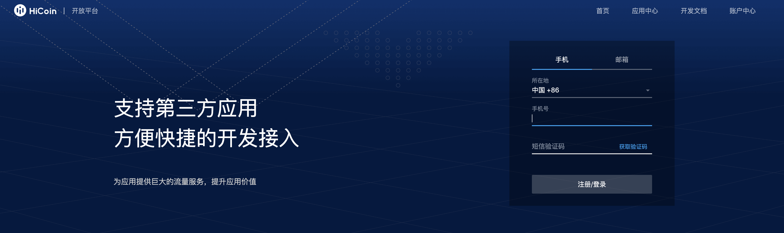
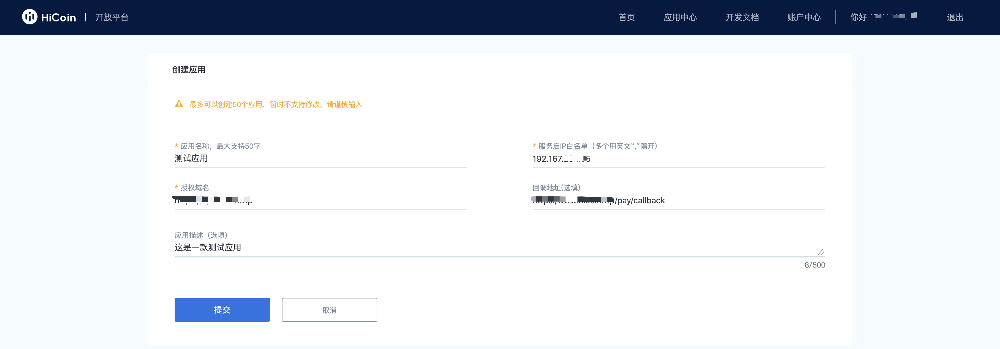
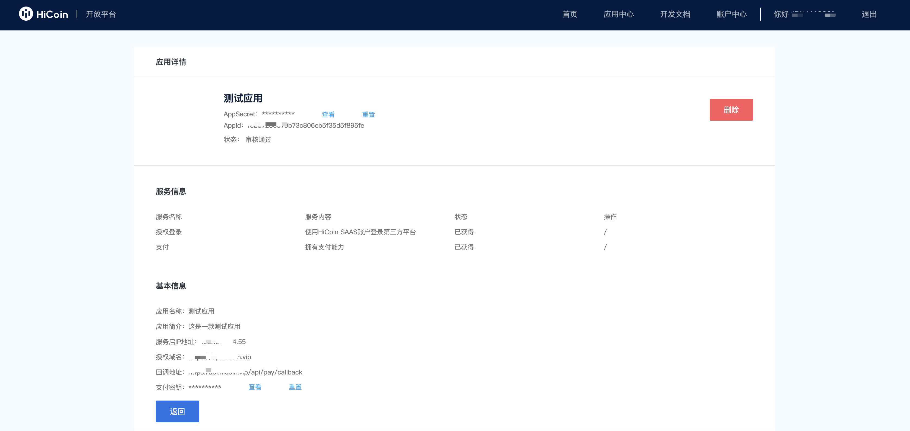
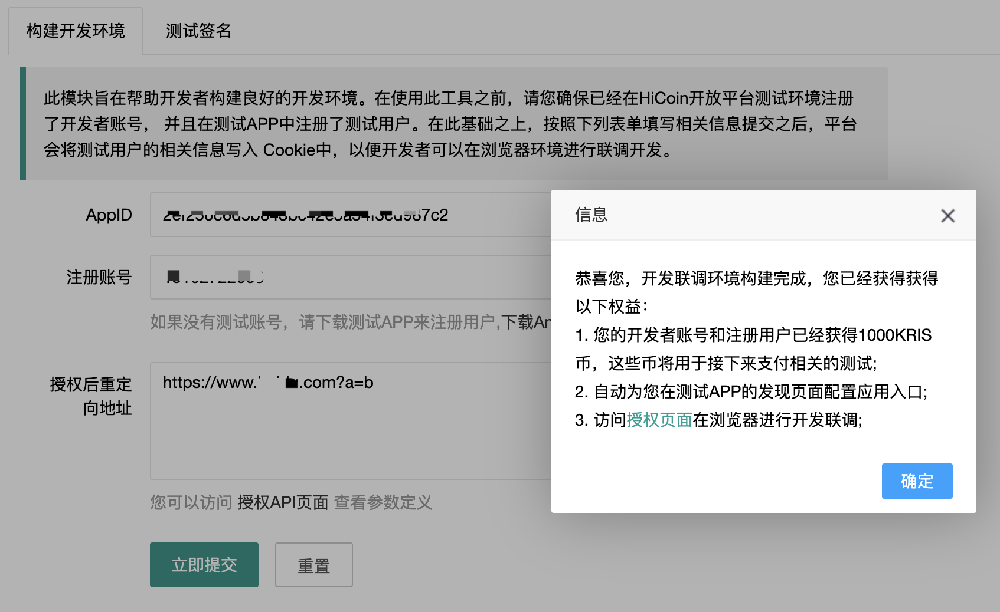
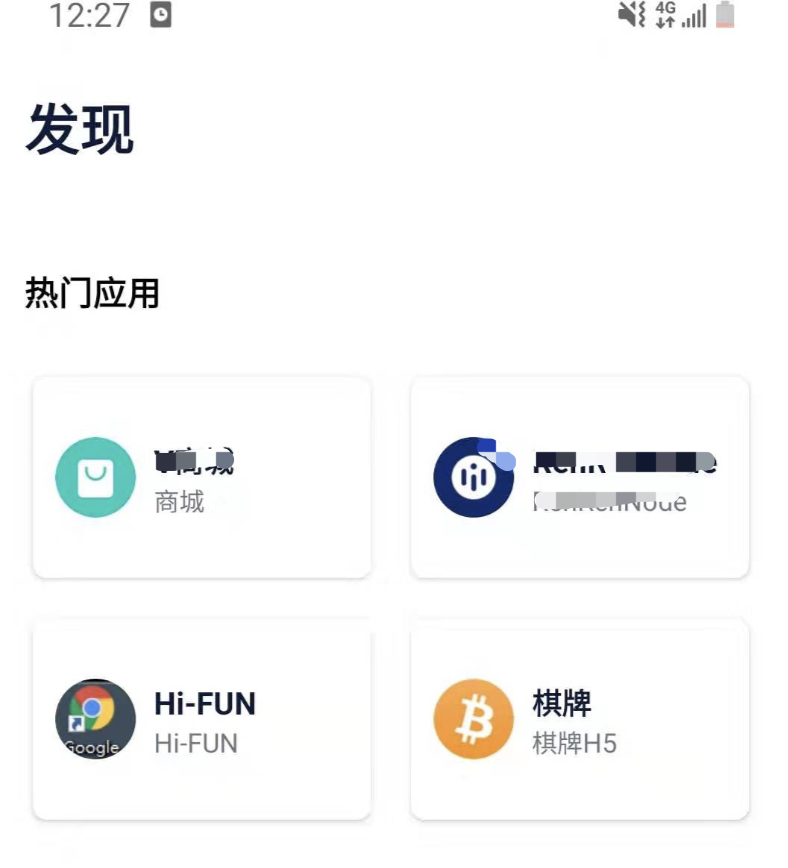

前期准备
================
开发者对接的整个流程： 注册开发者账号->应用申请->应用对接->发布应用

1. 开发须知
::::::::::::::::

1.1 关于授权access_token和基础access_token的区别
''''''''''''''''''''''''''''''''''''''''''''''''''''''

1）网页授权是通过OAuth2.0机制实现的，在用户授权给第三方平台后，第三方平台可以获取到一个网页授权特有的接口调用凭证（网页授权access_token），通过网页授权access_token可以进行授权后接口调用。授权access_token在整个文档的使用场景仅有两处，如下：支付预下单(/pay/preOrder)；获取用户基本信息（/sns/user/info ）。

2）相对于授权access_token，基础access_token作用于开发者。下面文档中如果没有特殊强调，access_token都是指基础access_token。

1.2 签名密钥
'''''''''''''''''''''''''''''''''''''''''''''

文档接口签名使用的密钥在没有特殊说明情况下，使用都是AppId对应的密钥SecretKey。目前涉及到H5支付相关的接口会使用支付密钥（mch_key）进行签名。

2. 注册开放者账号
:::::::::::::::::::::::::::::::::::

访问开放平台[参考附录一]，使用手机号或者邮箱注册开发者账号。值得注意的是，该账号今后也会用于管理应用对应的资金，因此在注册开发者账号时，请格外注意这一点。

3. 应用申请
::::::::::::::::

应用申请大致会经过以下几个阶段： 提交申请 -> 应用审核 -> 获取应用账号。

3.1 提交申请
'''''''''''''''
登录开放平台，进入应用中心，点击【创建应用】，然后填写应用申请的必要信息，主要包括：1）授权域名；2）IP白名单；3）支付回调地址。下图展示了申请应用的相关内容：

3.2 获取应用账号
''''''''''''''''''''''
开发者提交应用审核之后，平台通常在一天之内即可完成审核。审核之后，开发者会收到审核结果的短信或者邮箱通知。如果审核通过，登录开放平台，进入应用中心即可获取AppId和AppSecret。

4. 应用对接
::::::::::::::::
在对接生产环境的开放平台之前，建议您先在测试环境进行对接，这样有助于您在对接过程中遇得到问题进行相应地调试，因此，接下来的对接步骤仅适用于测试环境。

4.1 注册测试用户
'''''''''''''''''''''''
扫一扫下图所示二维码，下载测试APP，注册测试用户。注意，该测试账号尽量不要与开发者账号相同。

4.2 获取测试授权页面地址
''''''''''''''''''''''''
访问以下地址[参考附录一]，需要填写信息包括：1）AppId和SecretKey；2）4.1注册的测试账号；3）授权后重定向地址，与授权页面的参数redirect_uri一致。提交填写的内容之后，您的开发者账号和注册用户将得到一定量的KRIS币用于接下来的测试。下图展示了填写的相关内容：

4.3 在APP中验证
''''''''''''''''''''''''
这一步应该发生在应用对接完成的最后阶段进行，因为对接过程中大部分时间都在浏览器中调试，为了确保在生产环境能够正常运行，也需要在APP中进行一次全面的测试。打开您在第一步中下载的测试APP，进入【发现】页面，找到与您应用名称相关的入口，打开应用进行相应测试验证。

5. 发布应用
::::::::::::::::
如果您是在测试环境，发布应用已经在4.2这一步系统自动帮您处理了。线上环境需要您联系具体对接的商户在后台进行配置。
