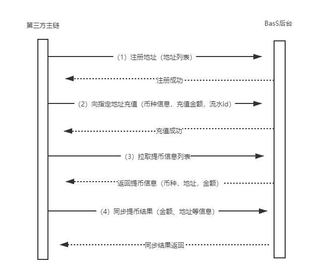

三、对接方案
====================

为了让公链接入者更便捷、快速的接入waas 联盟，我们提供了BaaS服务，以满足公链对接需求，平台基于过往客户的对接经验，梳理了一套对接方案。具体如下：

整个方案共分三个流程：

1、注册充币地址

2、用户充币

3、用户提币

整体交互流程如下
-------------------

1.获取充币地址
-------------------

1）可通过币种名称查询可用地址数量（推送地址时有数量限制）

2）向baas平台传递币种名称和地址列表，响应成功后及代表注册地址成功

注：若注册币种的类型为memo类型，则同一个地址只允许注册一次。

2.用户充币
-------------------

1）第三方钱包监测到地址有充币交易

2）发起充值通知，通知BaaS系统

3）返回充值结果

3.用户提币
-------------------

1）用户在三方钱包系统发起提币请求，获取提币信息列表

2）主链开发者处理提币，并通知BaaS接口

3）BaaS返回提币通知结果

注：如遇特殊情况可以撤销提币请求，向BaaS接口推送通知

