二、接入指引
====================

您需要按照以下流程进行接入ChainUP Custody

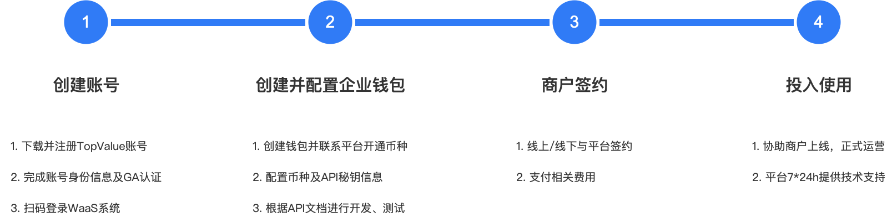

1.创建账号
-------------------

1.1 下载TopValue钱包
~~~~~~~~~~~~~~~~~~~

方式一：手机浏览器打开链接：https://custody.chainup.com/appDownload/

方式二：使用微信扫码打开链接下载：

1.2 注册TopValue账号
~~~~~~~~~~~~~~~~~~~
打开【TopValue】应用，注册账号（未注册账号登录即注册），支持邮箱与手机号两种方式

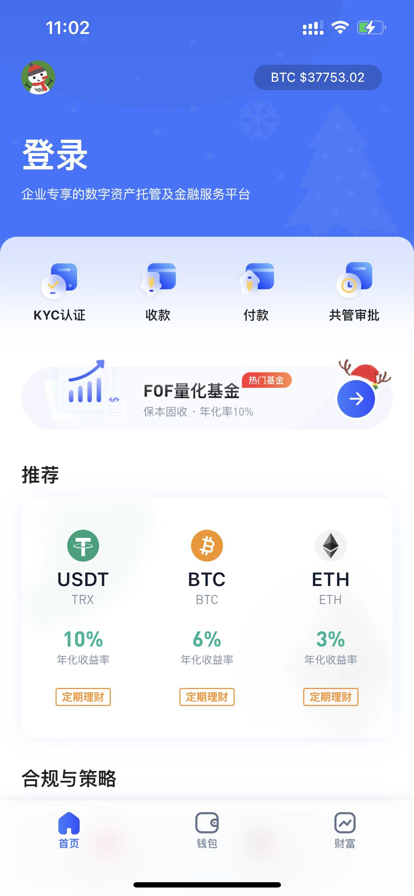

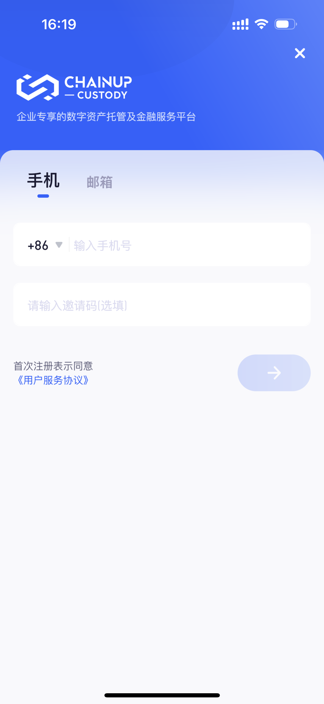

1.3 完成身份认证
~~~~~~~~~~~~~~~~~~~
打开个人中心-【未认证】，进入身份认证页面

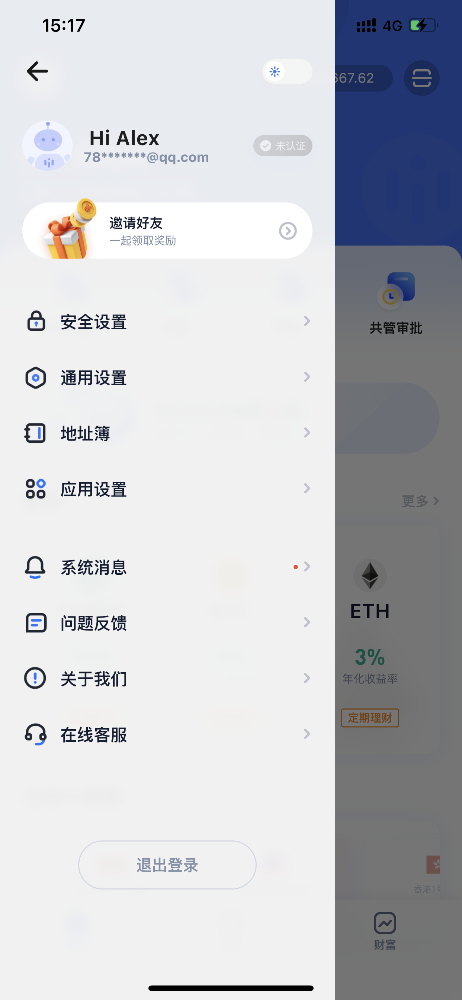

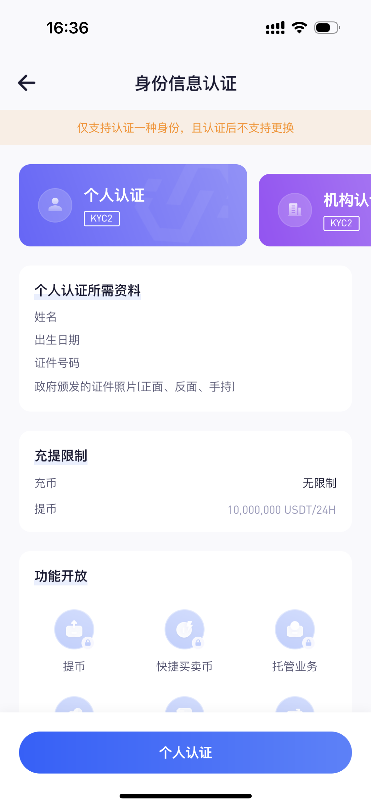

完成【身份等级认证】、【谷歌验证】（安全等级2需要平台审核，您可以联系项目经理或客服快速审核）

2.创建并配置企业钱包
-------------------

2.1 登录ChainUP Custody平台
~~~~~~~~~~~~~~~~~~~

浏览器打开ChainUP Custody平台（waas.chainup.com 或 custody.chainup.com），使用【TopValue】应用，首页或云端钱包【扫码】功能扫描二维码登录

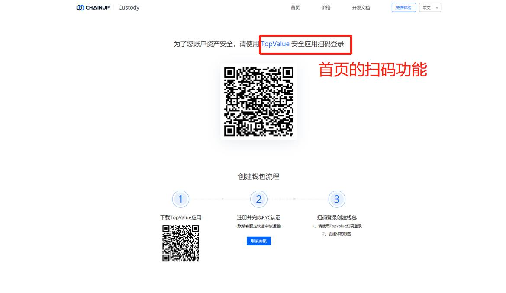

2.2 创建钱包
~~~~~~~~~~~~~~~~~~~

进入【ChainUP Custody】页面，创建钱包（钱包名称不支持修改，请谨慎填写）

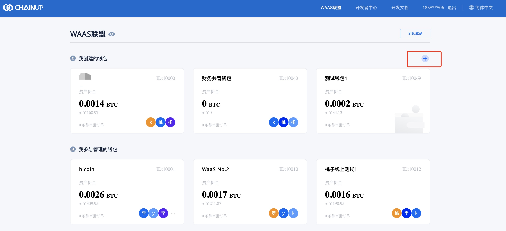

2.2 开启币种
~~~~~~~~~~~~~~~~~~~

开启币种前，请先联系平台开通主链币种（开通主链币种后，对应代币即可免费使用，若未收录可联系平台免费上币）

开通币种后，进入钱包点击【币种管理】，搜索币种

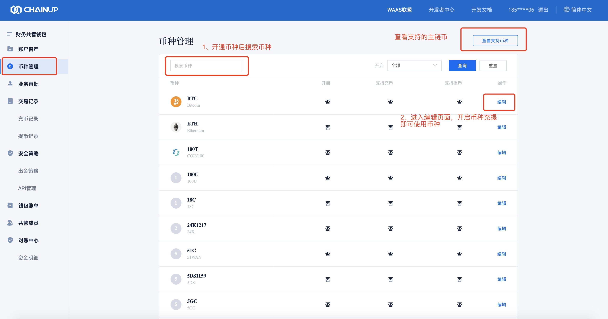

进入编辑页面，开启币种

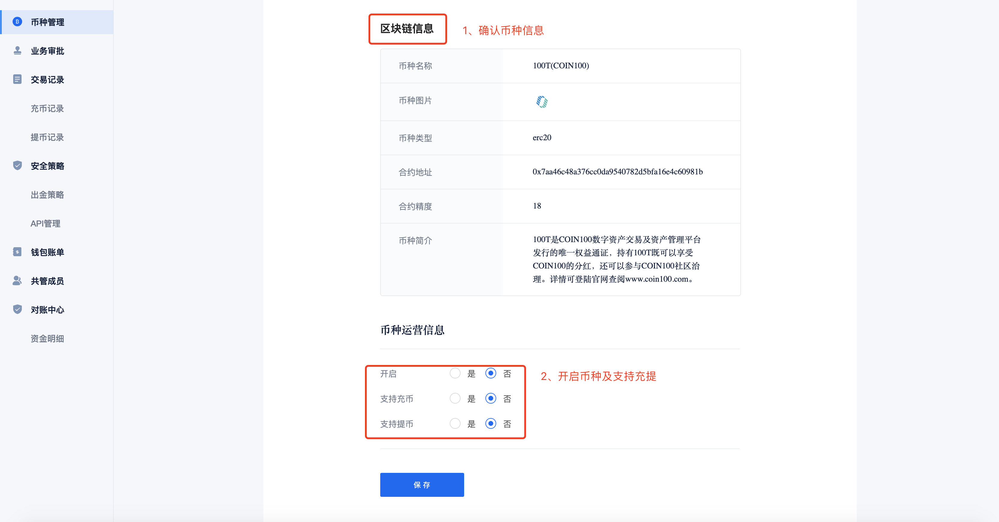

2.3 获取API信息
~~~~~~~~~~~~~~~~~~~

创建API（目前仅支持一个全功能权限的API）

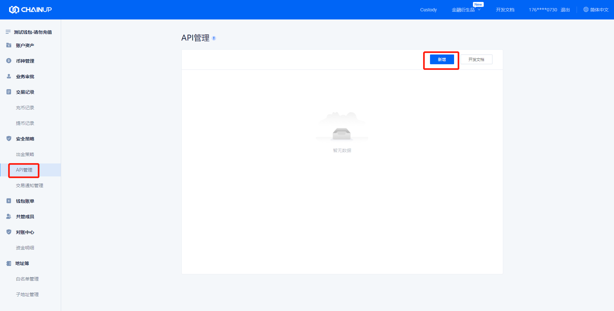

创建完成，完善公钥信息

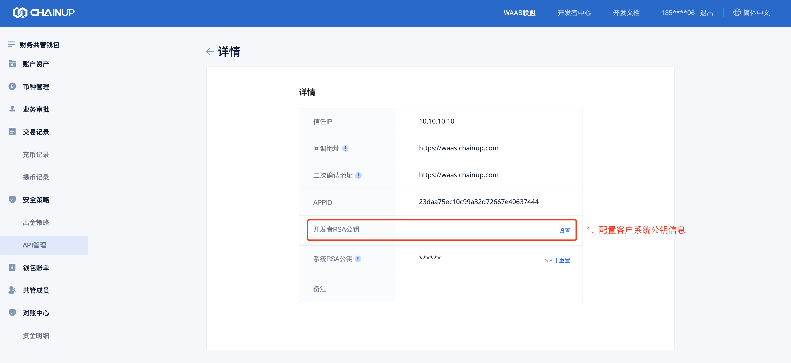

2.4 开发测试
~~~~~~~~~~~~~~~~~~~

根据平台提供的技术方案与API文档进行系统对接

3.商户签约
-------------------

3.1 正式签约
~~~~~~~~~~~~~~~~~~~

支持线上、线下签约

3.2 支付费用
~~~~~~~~~~~~~~~~~~~

支付系统订阅、安装等费用（具体费用类型以合同为准）

4.投入使用
-------------------

4.1 协助上线
~~~~~~~~~~~~~~~~~~~

协助商户正式上线运营

4.2 技术支持
~~~~~~~~~~~~~~~~~~~

平台提供7*24h技术支持
