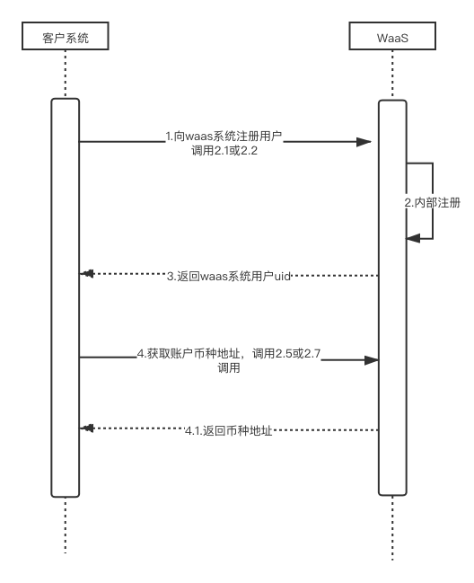
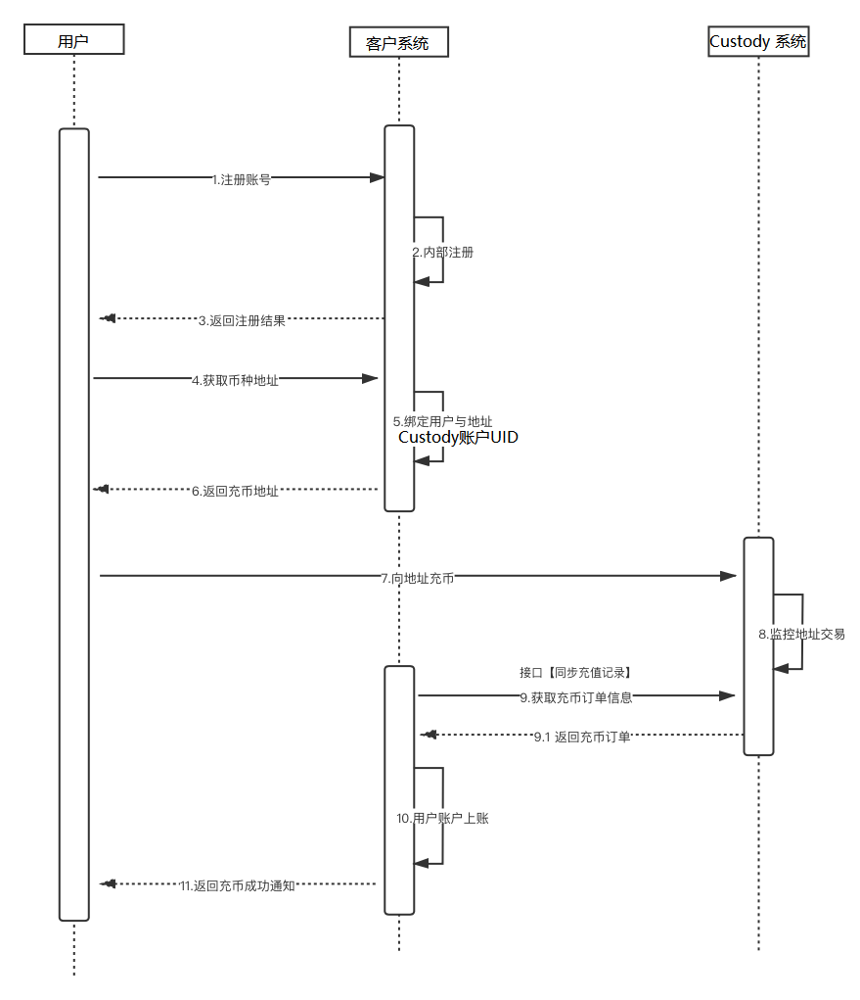
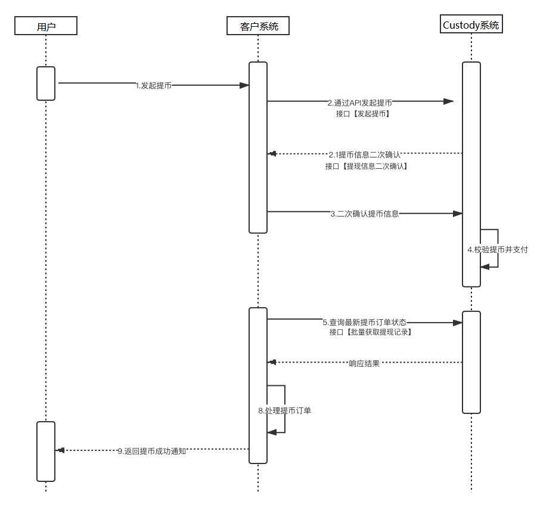
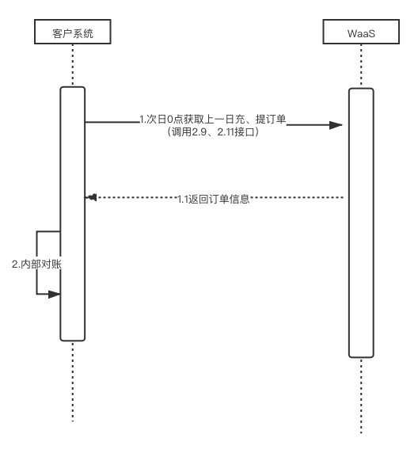

三、对接方案
====================

为了让客户更便捷、快速的接入WaaS服务，平台基于过往客户的对接经验，梳理了一套比较完善的技术对接方案。具体如下：

整个方案共分四个流程：

1、获取充币地址

2、用户充币

3、用户提币

4、财务对账

注：若客户项目时间紧迫，可优先开发必须流程【获取充币地址】、【用户充币】、【用户提币】，【财务对账】流程可二期开发。

1.获取充币地址
-------------------

1）客户向waas系统注册用户（建议使用邮箱）

2）注册成功后通过waas系统的UID获取地址

注：提前获取地址有利于用户注册后高效分配地址；若用户注册后再通过接口获取地址，有可能因为网络等其它原因造成获取失败，导致用户无法正常完成业务。

2.用户充币
-------------------

1）用户在客户系统内完成注册

2）当用户在前端查看币种充值地址时，客户系统为用户分配币种地址

3）用户向地址充币

4）WaaS系统监控区块链地址有充币交易，在WaaS系统为客户上账，并主动通知客户系统或客户系统主动获取

5）客户系统确认充币信息有效后给用户上账

6）客户系统通知用户充币成功

注：Waas系统的异步回调是当每笔订单最终态时才会触发，每日最多发送5次；

开启：定时任务  总计回调五次
//通知时间：第一次1s, 第二次2min，第三次8min，第四次32min，第五次128min
if(回调成功){
  更新回调状态，停止回调。
else if(失败，且回调次数小于5）{
  继续回调，更新下次回调间隔时间
}else（失败 ，且回调次数>=5){
 停止回调
}

3.用户提币
-------------------

1）用户在客户系统发起提币

2）客户系统审核通过后，通知WaaS系统

3）WaaS系统向客户系统进行提币信息二次确认

4）客户系统确认提币信息有效后waas系统校验提币信息，校验通过发起支付

5）Waas系统监控提币订单状态，提币完成，主动通知客户系统或客户系统主动获取

6）客户系统通知用户提币成功

4.财务对账
-------------------

1）客户系统按周期与WaaS系统对账（建议按日）

2）次日0点获取上一日的所有充币、提币以及消耗的归集矿工费订单

3）客户系统订单与WaaS系统内的订单做比对

4）若订单数量、金额、状态等无误则对账成功；否则对账异常，联系WaaS技术人员协助处理

注：Waas系统内三方系统共有三种成本支出：归集矿工费、提币矿工费、分润手续费；

a) 归集矿工费：账户类型的币种，充币后地址上的资金会归集到热钱包地址，归集走区块链网络，部分主链区块链交易会消耗矿工费，这部分成本由客户承担；此部分资金支出需要联系我方处理

b) 提币矿工费：提币到非waas联盟的地址，走区块链网络需要消耗矿工费（部分币种），消耗的矿工费由三方承担；此部分资金支出在提币订单内可以直接查看；

c) 分润手续费：暂不收取
