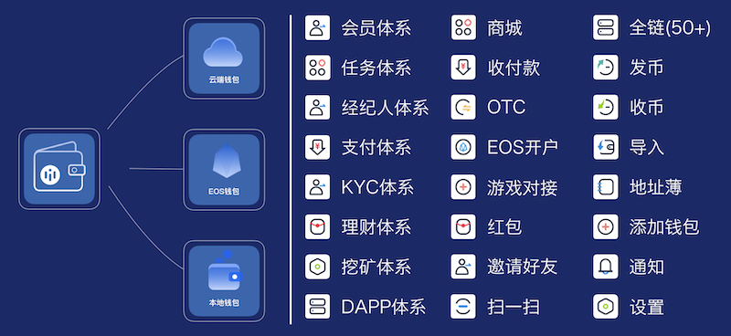

.. HiCoin documentation master file, created by
   sphinx-quickstart on Sun Sep  1 21:32:34 2019.
   You can adapt this file completely to your liking, but it should at least
   contain the root `toctree` directive.

功能概述
==========

30+功能模块，200+功能点
--------------------------

HiCoin基于海量的客户需求，研发了三大钱包系统：云端钱包（中心化钱包），HD钱包（去中心化钱包）及EOS 钱包（去中心化EOS钱包），同时汇总了30+功能模块，200+功能点，以下为用户可见常用模块与功能展示图：

APP功能点(基于2.3.2版本)
--------------------------------

后台功能点(基于201909版本)
--------------------------------