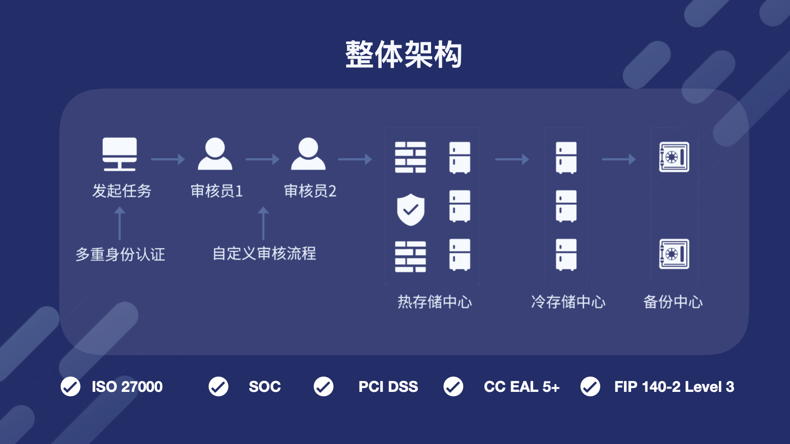
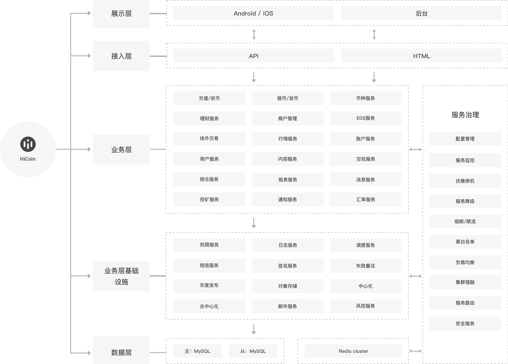
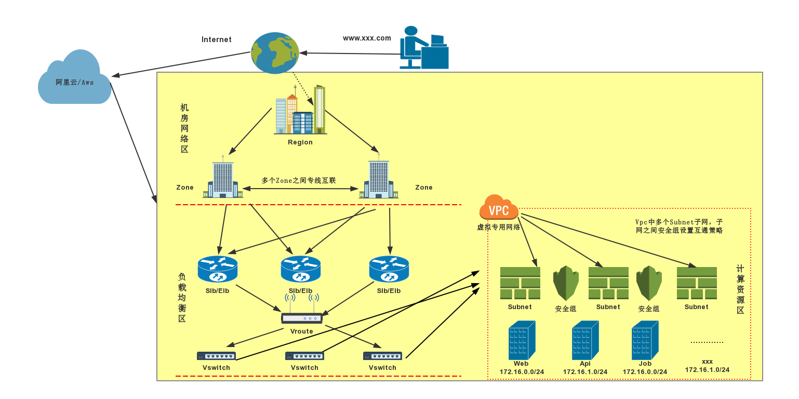
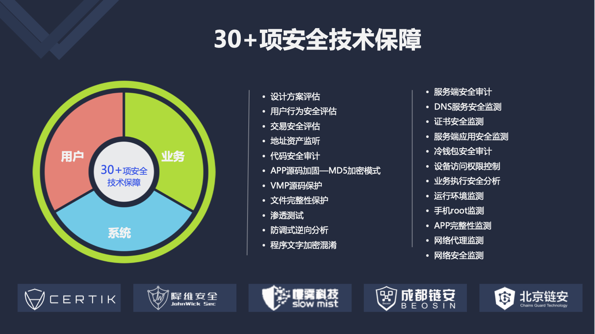

技术架构概述
======================

1 整体概述
--------------

HiCoin定位是 **钱包技术平台** 。

**钱包** 意味着金融，所以我们整个系统按照国际金融体系标准（ISO27000,SOC,CC EAL4+,FIPS 140-2 level3等）来构建。

**技术平台** 意味着我们作为一个区块链的底层服务，除了需要在技术上面做到专业外，还需要具有极强的扩展性。HiCoin在技术上面采用 **五横一纵模块化** 策略，模块之间通过微服务进行低耦合动态扩展，同时我们提供了完整的 WaaS接口文档和开放平台文档，真实让钱包从业务形态上面平台化，让钱包作为一个基础服务不仅可以 **走出去** （集成到其它应用，像支付宝一样为其它应用提供支付或者是上链服务），也可以 **接进来** （其它应用像小程序一个集成到钱包中，打通帐户及资产划转）。

各端使用语言汇总：

:后端: Java （SpringCloud, RabbitMQ, Mysql, Redis, ）

:前端: vue技术栈(vue-cli3.0结合webpack搭建的多站点框架), React

:IOS客户端: Swift 为主要开发语言，采用MMVC模式，同时支持Object-C混编。

:Android客户端: Kotlin 为主要语言，采用MVP模式，同时支持Java混编。

:底层钱包: 基础不同主链使用语言而定 比如：go, python,C/C++ 等。

整体框架图：

2 整体技术框架
-----------------------

HiCoin整体框架采用五横一纵模块化展开，做到模块之间低耦合、高并发、强鲁棒。

**五横** 是指将系统按不同业务属性从底向上分为：数据层、基础层、业务层、接入层、展示性。通过不同模块特性定制高并发策略，同时让不同层级及模块之间低耦合。

**一纵** 是指通过监控、路由、容灾、负载均衡等治理服务让五横更加稳定与鲁棒。

如下图所示：

3 服务器网络框架
-----------------------

整个HiCoin的网络框架分为三个区域：**机房网络区** 、**负载均衡区** 、**计算资源区** 。整体架构采用同城双活机房，保证服务高可用，无单点故障，当访问压力超过指标后分钟及自动扩容，无需人工干预。同时通过虚拟专用网络(VPC)设置多个子网(Subnet)，子网之间设置安全互通策略。

4 30+项安全技术保障
---------------------------------
HiCoin同时也与世界顶级区块链安全公司：Certik、降维、慢雾、成都链安、北京链安等深度合作，从用户、业务、系统三个大方向采用30+项安全技术保障来保障系统更加安全。

